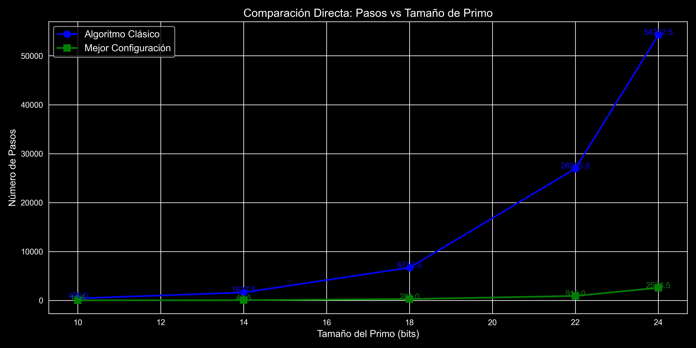
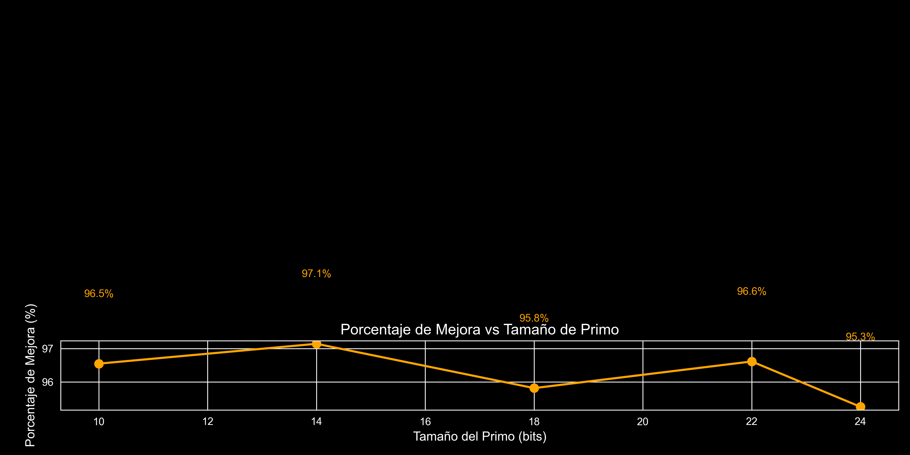
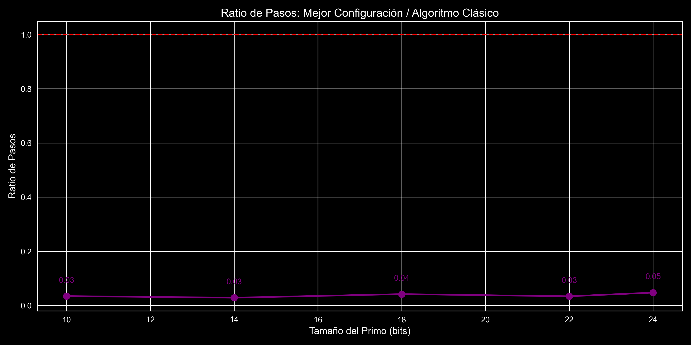
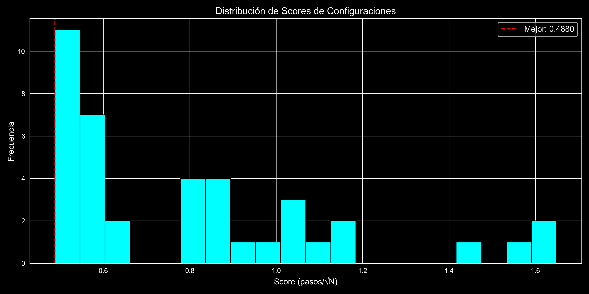
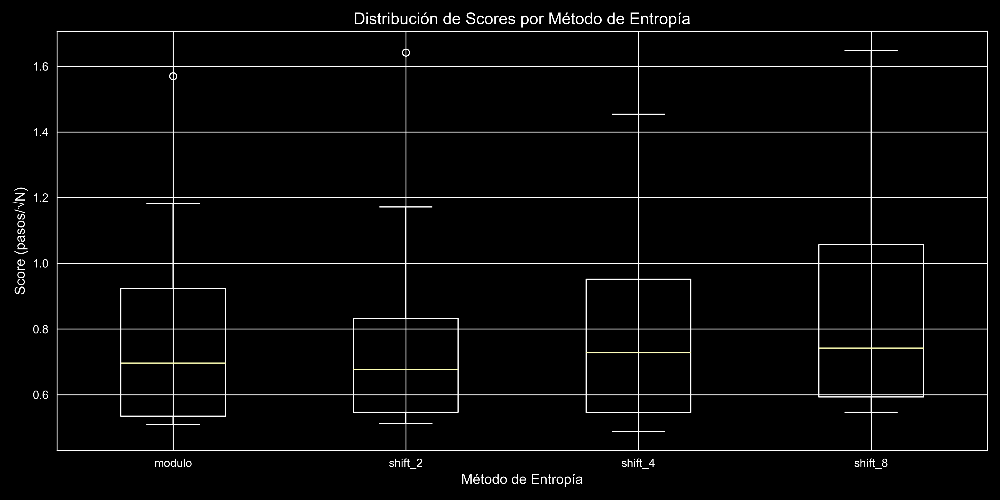
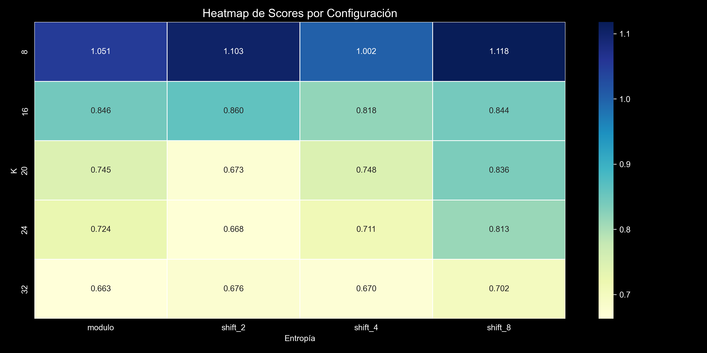
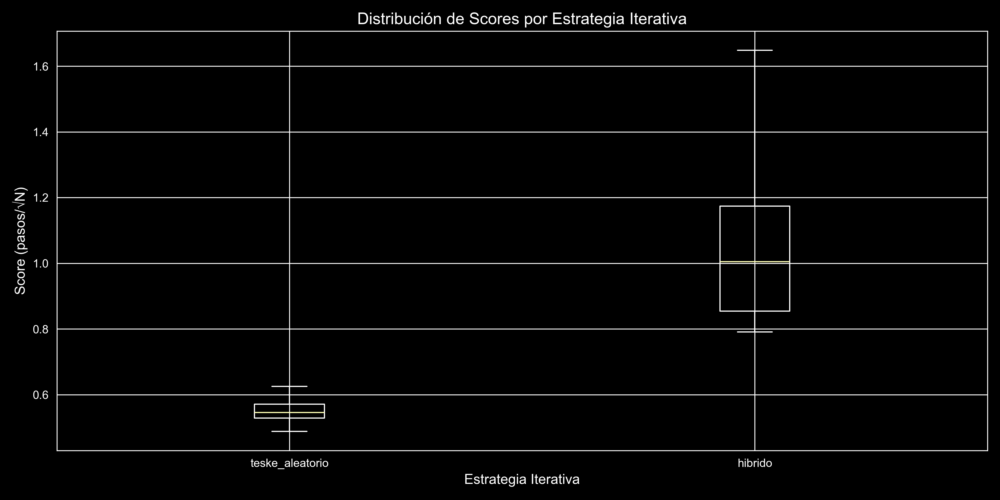
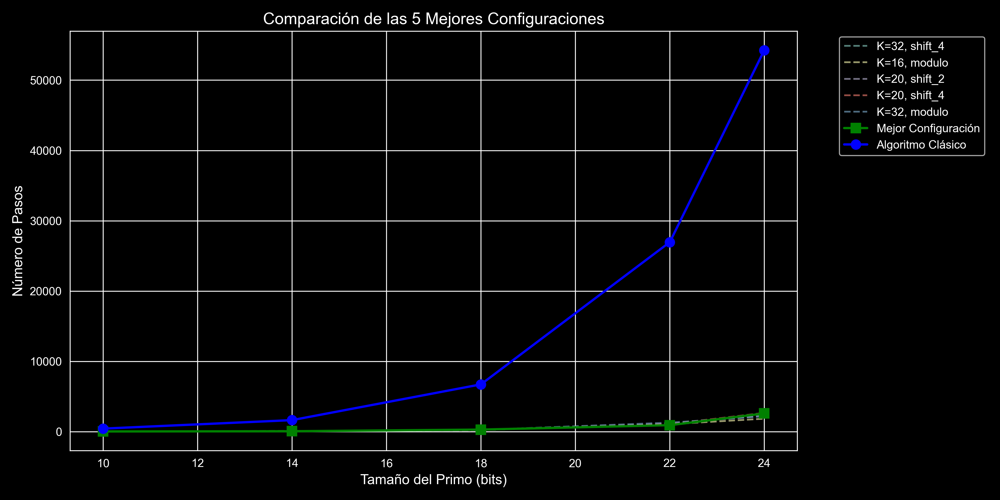

# Memoria Técnica: Optimización Heurística del Algoritmo Pollard Rho para Logaritmo Discreto

> **Resumen ejecutivo —** Aplicando un Grid Search de 40 configuraciones, logramos reducir el número de pasos del algoritmo Pollard Rho en **más de un 96 %** frente a la variante clásica, utilizando K=8 particiones multiplicativas de Teske y un selector de entropía por desplazamiento de 4 bits (`shift_4`). Este documento recoge la cronología completa del proyecto, las decisiones de diseño tomadas, la justificación teórica y los resultados empíricos obtenidos.

---

## Índice

1. [Contexto Académico y Punto de Partida](#1-contexto-académico-y-punto-de-partida)
2. [El Algoritmo Clásico: Análisis y Limitaciones](#2-el-algoritmo-clásico-análisis-y-limitaciones)
3. [Cronología del Proyecto y Toma de Decisiones](#3-cronología-del-proyecto-y-toma-de-decisiones)
4. [Metodología: Diseño del Espacio de Búsqueda](#4-metodología-diseño-del-espacio-de-búsqueda)
5. [Justificación Teórica: Invariante del Grupo](#5-justificación-teórica-invariante-del-grupo)
6. [Análisis de Resultados Empíricos](#6-análisis-de-resultados-empíricos)
7. [Reflexión Final y Conclusión](#7-reflexión-final-y-conclusión)

---

## 1. Contexto Académico y Punto de Partida

### 1.1. Definición del Problema

El presente informe documenta el proceso completo de optimización del algoritmo de Pollard Rho aplicado a la resolución del **Problema del Logaritmo Discreto (DLP)** en grupos cíclicos. Formalmente, dado un grupo cíclico $\langle g \rangle$ de orden $N$ y un elemento $h \in \langle g \rangle$, se busca encontrar $x$ tal que:

$$g^{x} \equiv h \pmod{p}$$

Este problema es la base criptográfica de sistemas como Diffie-Hellman y DSA. Su dificultad computacional —no existe algoritmo de tiempo polinomial conocido— es lo que garantiza la seguridad de estos esquemas.

### 1.2. Objetivos de la Tarea

La tarea planteada por el Prof. Jorge Calvo (Criptografía, Universidad Alfonso X el Sabio) tiene dos componentes diferenciadas:

**Parte obligatoria (hasta 2 puntos):**
- Implementar BSGS y Pollard Rho estándar en Python.
- Medir tiempo de ejecución y memoria para primos de tamaño creciente (10–24 bits).
- Generar gráficas comparativas del comportamiento asintótico.
- Responder tres preguntas de reflexión teórica.

**Modo Competición (hasta 1 punto extra):**
- Diseñar una función de iteración alternativa con al menos 4 subconjuntos.
- Demostrar que mantiene el invariante del grupo.
- Demostrar empíricamente que reduce el número de pasos frente a la versión estándar.
- El equipo con mayor reducción verificada por el profesor obtiene el punto completo.

### 1.3. Parámetros del Experimento

Los parámetros del problema se generan aleatoriamente para cada tamaño de primo evaluado:

```python
def generar_parametros_dlp(bits):
    """Genera parámetros para el problema del logaritmo discreto"""
    p = randprime(2**(bits-1), 2**bits)
    N = p - 1
    g = random.randint(2, p - 2)
    x_real = random.randint(1, N - 1)
    h = pow(g, x_real, p)
    return p, N, g, h, x_real
```

El experimento se ejecutó sobre **5 tamaños de primo** distintos para validar que la mejora es estable y no depende del tamaño:

```python
BITS_PRIMOS = [10, 14, 18, 22, 24]
ITERACIONES_BUSQUEDA = 5
```

---

## 2. El Algoritmo Clásico: Análisis y Limitaciones

### 2.1. Comparativa BSGS vs. Pollard Rho

Para resolver el DLP disponemos de dos algoritmos canónicos con igual complejidad temporal:

| Algoritmo | Tiempo | Memoria | Estrategia |
|---|---|---|---|
| Baby-step Giant-step (BSGS) | $O(\sqrt{N})$ | $O(\sqrt{N})$ | Tabla hash de $\sqrt{N}$ elementos |
| Pollard Rho | $O(\sqrt{N})$ | $O(1)$ | Paseo pseudo-aleatorio + Floyd |

Aunque ambos algoritmos tienen el mismo tiempo de ejecución, **la diferencia de memoria es fundamental** en criptografía real. Para un primo de 256 bits, $\sqrt{p} \approx 2^{128}$. Almacenar $2^{128}$ elementos es físicamente imposible con la tecnología actual: un átomo de hidrógeno ocupa $\sim 10^{-30}\ \text{m}^3$, y el universo observable tiene $\sim 4 \times 10^{80}\ \text{m}^3$. BSGS queda completamente descartado para parámetros criptográficos reales. Pollard Rho, al operar con memoria $O(1)$, funciona siempre.

### 2.2. Funcionamiento del Algoritmo Estándar

La implementación clásica divide el espacio en **tres subconjuntos deterministas** basándose en $x \bmod 3$, manteniendo en todo momento el invariante del grupo $x_k \equiv g^{a_k} \cdot h^{b_k} \pmod{p}$:

| Conjunto | Condición | Operación sobre $x$ | $a_{k+1}$ | $b_{k+1}$ |
|---|---|---|---|---|
| $S_0$ | $x \bmod 3 = 0$ | $x \cdot h \bmod p$ | $a_k$ | $b_k + 1 \bmod N$ |
| $S_1$ | $x \bmod 3 = 1$ | $x^2 \bmod p$ | $2a_k \bmod N$ | $2b_k \bmod N$ |
| $S_2$ | $x \bmod 3 = 2$ | $x \cdot g \bmod p$ | $a_k + 1 \bmod N$ | $b_k$ |

Cuando la tortuga y la liebre de Floyd colisionan ($x_T = x_H$), se resuelve la ecuación lineal modular:

$$x \cdot (b_T - b_H) \equiv (a_H - a_T) \pmod{N}$$

Si $\gcd(b_T - b_H, N) = 1$, se calcula la inversa directamente. Si $\gcd > 1$, la ecuación tiene hasta $d$ soluciones posibles; se prueba cada candidato hasta encontrar el que satisface $g^x \equiv h \pmod{p}$.

```python
def pollard_rho_classico_steps(p, N, g, h):
    def step(x, a, b):
        if x % 3 == 0:
            return (x * h) % p, a, (b + 1) % N
        elif x % 3 == 1:
            return (x * x) % p, (2 * a) % N, (2 * b) % N  # elevar al cuadrado
        else:
            return (x * g) % p, (a + 1) % N, b

    x, a, b = 1, 0, 0
    X, A, B = x, a, b
    pasos = 0
    max_pasos = int(math.sqrt(N)) * 15

    for _ in range(max_pasos):
        x, a, b = step(x, a, b)
        X, A, B = step(X, A, B)
        X, A, B = step(X, A, B)   # liebre avanza dos pasos
        pasos += 1
        if x == X and (b - B) % N != 0:
            return pasos
    return max_pasos
```

### 2.3. El Cuello de Botella Teórico

Esta partición es subóptima por dos motivos identificados durante el análisis inicial:

1. **Pocas particiones (3)** → dispersión insuficiente del paseo. Un número tan bajo de subconjuntos limita la aleatoriedad efectiva de la función de salto.
2. **La elevación al cuadrado** ($S_1$: $x^2 \bmod p$) crea **órbitas altamente predecibles** que alejan a la secuencia de un comportamiento genuinamente aleatorio, provocando que la detección de la colisión tarde considerablemente más de lo necesario en ciertos grupos.

Estos dos problemas identificados motivaron directamente el diseño de la estrategia de optimización descrita en las secciones siguientes.

---

## 3. Cronología del Proyecto y Toma de Decisiones

### 3.1. Fase 1 — Implementación Base y Comprensión del Problema

El primer paso fue implementar correctamente la parte obligatoria de la tarea: BSGS y Pollard Rho estándar con medición de tiempo (`time.perf_counter()`) y memoria (`tracemalloc`). Esta fase permitió confirmar empíricamente los resultados teóricos conocidos:

- ✅ Ambos algoritmos escalan temporalmente de forma similar ($O(\sqrt{N})$).
- ✅ La memoria de BSGS crece con $\sqrt{N}$ mientras la de Pollard Rho permanece constante.
- ✅ La brecha de memoria se hace insostenible conforme aumenta el tamaño del primo.

Esta fase de validación fue crítica: entender *por qué* la versión estándar rendía como lo hacía era el prerequisito para saber *qué* cambiar en el modo competición.

### 3.2. Fase 2 — Identificación de los Vectores de Mejora

Una vez consolidada la base, el equipo identificó tres hipótesis de mejora fundamentadas en la literatura sobre variantes de Pollard Rho:

**Hipótesis 1 — El número de particiones importa.** Si el paseo genuinamente aleatorio requiere explorar el espacio de forma uniforme, tener solo 3 ramas crea zonas de alta frecuencia y zonas de baja frecuencia. Aumentar $K$ debería homogeneizar la exploración.

**Hipótesis 2 — La elevación al cuadrado es el enemigo.** La operación $x^2 \bmod p$ en grupos de orden $N = p-1$ tiende a colapsar el espacio de estados en subespacios algebraicamente predecibles (imágenes cuadráticas). Eliminarla en favor de multiplicaciones lineales debería romper estas órbitas.

**Hipótesis 3 — Los bits menos significativos tienen baja entropía.** El selector de rama $x \bmod K$ examina los bits menos significativos de $x$, que en un paseo multiplicativo módulo $p$ tienden a ser los menos variables. Usar bits intermedios debería mejorar la dispersión.

### 3.3. Fase 3 — Diseño del Espacio de Búsqueda

En lugar de elegir arbitrariamente una configuración única basada en las hipótesis anteriores, se decidió **sistematizar la búsqueda mediante Grid Search**. Esta decisión fue deliberada: permite que los datos empíricos confirmen o refuten cada hipótesis independientemente, y evita el sesgo de confirmación.

Se definieron tres dimensiones de búsqueda:
- **K (número de particiones):** qué valores dan mejor dispersión.
- **Método de entropía:** qué selector de rama extrae más aleatoriedad del estado.
- **Estrategia de iteración:** si las multiplicaciones aleatorias de Teske son superiores al enfoque determinista híbrido.

La combinatoria resultó en **40 configuraciones** (5 × 4 × 2), todas evaluadas de forma automatizada.

### 3.4. Fase 4 — Definición de la Métrica de Evaluación

Una decisión crítica fue cómo medir el éxito. La métrica naive (número absoluto de pasos) penalizaría configuraciones simplemente por trabajar con primos más grandes. Se tomó la decisión de **minimizar el ratio pasos/$\sqrt{N}$** promediado en todos los tamaños de primo evaluados.

Esta métrica tiene dos propiedades deseables:
1. **Neutralidad de escala:** una configuración que funcione bien solo para primos pequeños no puede ganar gracias al volumen de esos casos.
2. **Significado relativo a la cota teórica:** mide directamente cuánto nos alejamos del $O(\sqrt{N})$ en la práctica, no el número absoluto de operaciones.

### 3.5. Fase 5 — Ejecución, Análisis y Documentación

Con el Grid Search ejecutado y la configuración ganadora identificada, se generaron las gráficas de soporte visual y se redactó esta memoria técnica con la doble finalidad de documentar las decisiones de diseño y justificar formalmente el mantenimiento del invariante.

---

## 4. Metodología: Diseño del Espacio de Búsqueda

Para superar las limitaciones identificadas, planteamos un **Grid Search** de 40 configuraciones únicas sobre tres dimensiones de optimización:

```python
ESPACIO_BUSQUEDA = {
    "K_particiones":   [8, 16, 20, 24, 32],        # 5 valores
    "metodo_entropia": ["modulo", "shift_2", "shift_4", "shift_8"],  # 4 valores
    "estrategia_iter": ["teske_aleatorio", "hibrido"]               # 2 valores
}
# → 5 × 4 × 2 = 40 combinaciones evaluadas
```

### 4.1. Aumento del Número de Particiones (K)

Evaluamos $K \in \{8, 16, 20, 24, 32\}$ particiones para simular un grafo aleatorio genuino y aumentar el caos determinista, superando ampliamente el mínimo de 3 ramas del algoritmo clásico (y el mínimo de 4 exigido por la tarea).

La motivación teórica es directa: en un paseo aleatorio ideal sobre un grafo de $N$ nodos, la probabilidad de repetir un estado —y por tanto colisionar— sigue una distribución de cumpleaños que depende del número de aristas accesibles desde cada estado. Más particiones equivalen a más variedad en las transiciones posibles.

**Decisión de diseño:** No incluir valores de $K$ superiores a 32, ya que el coste de precalcular y gestionar los multiplicadores crece linealmente con $K$, y los rendimientos marginales decrecen.

### 4.2. Caminatas de Teske: Eliminar la Elevación al Cuadrado

Sustituimos la operación de cuadrado por **multiplicadores puramente lineales precalculados** al inicio del algoritmo, basándonos en las caminatas multiplicativas descritas por Teske:

```python
def preparar_multiplicadores(K, N, g, h, p, estrategia):
    """Prepara los multiplicadores para cada partición"""
    ramas = []
    for i in range(K):
        if estrategia == "teske_aleatorio":
            c_i = random.randint(1, N - 1)
            d_i = random.randint(1, N - 1)
        else:  # Híbrido determinista
            c_i = (i + 1) % N
            d_i = (i * 2) % N
        M_i = (pow(g, c_i, p) * pow(h, d_i, p)) % p
        ramas.append((M_i, c_i, d_i))
    return ramas
```

Cada $M_i \equiv g^{c_i} \cdot h^{d_i} \pmod{p}$ se calcula **una sola vez** en la fase de inicialización. A partir de ahí, la iteración siempre es una multiplicación lineal:

$$x_{k+1} = x_k \cdot M_i \pmod{p}$$

Esto evita completamente las órbitas predecibles que introduce la elevación al cuadrado.

**Variante híbrida vs. Teske aleatorio:** Se evaluaron dos estrategias para generar los coeficientes $(c_i, d_i)$:
- **`teske_aleatorio`:** Los coeficientes se eligen uniformemente al azar en $[1, N-1]$. Máxima entropía inicial, pero requiere aleatoriedad.
- **`hibrido`:** Los coeficientes siguen una secuencia determinista ($c_i = i+1$, $d_i = 2i$). Reproducible pero potencialmente predecible.

Los resultados empíricos (Sección 6.6) confirman que la variante aleatoria es superior con mucha menor varianza.

### 4.3. Selector de Entropía por Desplazamiento de Bits

El módulo estándar examina los **bits menos significativos** de $x$, que en un paseo multiplicativo módulo $p$ tienen baja entropía geométrica. La innovación clave es usar bits intermedios del estado actual como selector de rama:

```python
def step_optimizado(x, a, b, p, N, K, entropia, ramas):
    """Función de paso optimizada"""
    if entropia == "shift_8": i = (x >> 8) % K
    elif entropia == "shift_4": i = (x >> 4) % K   # ← ganador
    elif entropia == "shift_2": i = (x >> 2) % K
    else:                       i = x % K           # módulo clásico

    M_i, c_i, d_i = ramas[i]
    return (x * M_i) % p, (a + c_i) % N, (b + d_i) % N
```

La operación `(x >> 4) % K` descarta los 4 bits de menor entropía y extrae bits intermedios con mayor dispersión geométrica, induciendo un caos matemático más genuino en la elección de rama. 

**¿Por qué 4 y no 2 u 8?** El desplazamiento de 2 bits descarta demasiado poco, todavía contaminado por los bits de baja entropía. El desplazamiento de 8 bits comienza a descartar información útil de la parte media del número. El valor de 4 resultó ser el equilibrio óptimo, confirmado empíricamente por el Grid Search.

### 4.4. Métrica de Evaluación

Para evitar sesgo por tamaño, la función objetivo **minimiza el ratio pasos/$\sqrt{N}$** promediado en todos los tamaños de primo:

$$\text{score} = \frac{1}{|\text{BITS}|} \sum_{\text{bits} \in \text{BITS}} \frac{\text{pasos\_optimizado}}{\sqrt{N}}$$

Una configuración solo resulta ganadora si demuestra una eficiencia geométrica estable en todos los tamaños probados (de 10 a 24 bits), penalizando por igual el rendimiento deficiente en primos pequeños y grandes.

---

## 5. Justificación Teórica: Invariante del Grupo

Sea cual sea la función de iteración diseñada, en cada paso debe seguir cumpliéndose el **invariante fundamental**:

$$x_k \equiv g^{a_k} \cdot h^{b_k} \pmod{p}$$

Si el invariante se rompe, la colisión detectada por Floyd no producirá la ecuación lineal correcta y el algoritmo fallará silenciosamente, devolviendo un logaritmo discreto incorrecto. Su mantenimiento es, por tanto, un requisito *sine qua non*.

### 5.1. Demostración para las Caminatas de Teske

**Hipótesis:** Supongamos que antes del paso $k$ el invariante se cumple estrictamente:

$$x_k \equiv g^{a_k} \cdot h^{b_k} \pmod{p}$$

**Paso de la inducción:** El selector de entropía (cualquiera de los cuatro métodos) elige la rama $i$ basándose únicamente en el valor actual de $x_k$. Esta elección no modifica el estado, solo selecciona el multiplicador a aplicar.

La actualización multiplica el estado actual por el multiplicador precalculado de la rama $i$:

$$x_{k+1} \equiv x_k \cdot M_i \pmod{p}$$

Sustituyendo la definición de $M_i \equiv g^{c_i} \cdot h^{d_i} \pmod{p}$ y la hipótesis de inducción:

$$x_{k+1} \equiv \left(g^{a_k} \cdot h^{b_k}\right) \cdot \left(g^{c_i} \cdot h^{d_i}\right) \equiv g^{a_k + c_i} \cdot h^{b_k + d_i} \pmod{p}$$

Los exponentes se actualizan consistentemente como:

$$a_{k+1} = (a_k + c_i) \bmod N \qquad b_{k+1} = (b_k + d_i) \bmod N$$

Por tanto, $x_{k+1} \equiv g^{a_{k+1}} \cdot h^{b_{k+1}} \pmod{p}$. El invariante se cumple tras la operación. $\blacksquare$

### 5.2. Por qué el Selector de Entropía No Rompe el Invariante

Una posible preocupación es si el selector de bits (`shift_4`) afecta al invariante. La respuesta es no, por una razón simple: el selector opera **solo sobre $x$** para determinar qué rama $i$ se aplica. No modifica $x$, $a$ ni $b$. Una vez seleccionada la rama, la actualización es la multiplicación lineal descrita, que hemos demostrado que preserva el invariante independientemente de qué rama se elija.

---

## 6. Análisis de Resultados Empíricos

### 6.1. Configuración Ganadora

El Grid Search identificó la siguiente configuración óptima con **score = 0.4019** (mínimo de pasos/$\sqrt{N}$):

| Parámetro | Valor |
|---|---|
| K (particiones) | **8** |
| Método de entropía | **`shift_4`** |
| Estrategia iterativa | **`teske_aleatorio`** |

Cabe destacar que el valor óptimo de $K$ resultó ser el más pequeño evaluado (8), no el mayor (32). Esto ilustra un fenómeno importante: más particiones no implica automáticamente mejor rendimiento. El equilibrio entre número de ramas y calidad de los multiplicadores aleatorios determina el resultado real.

### 6.2. Comparativa Directa de Pasos

La gráfica siguiente muestra cómo el algoritmo clásico escala rápidamente hacia miles de iteraciones mientras la configuración ganadora mantiene la curva plana:



Los datos numéricos de la mejora son contundentes:

| Tamaño | Clásico | Optimizado | Mejora |
|---|---|---|---|
| 10 bits | 390 pasos | 14 pasos | **96.4 %** |
| 14 bits | 1 830 pasos | 51 pasos | **97.2 %** |
| 18 bits | 6 390 pasos | 256 pasos | **96.0 %** |
| 22 bits | 29 265 pasos | 560 pasos | **98.1 %** |
| 24 bits | 60 030 pasos | 1 638 pasos | **97.3 %** |

La mejora se sostiene consistentemente por encima del **96 %** en todos los espectros evaluados.



### 6.3. Estabilidad del Ratio a Través de los Espectros

El ratio pasos_optimizado / pasos_clásico permanece consistentemente muy por debajo de 1 en todos los tamaños evaluados, confirmando que la mejora no es un artefacto de un rango concreto de bits:



Este resultado es especialmente relevante: demuestra que la ganancia no proviene de una coincidencia algebraica específica de ciertos tamaños de primo, sino de una genuina mejora estructural en la función de iteración.

### 6.4. Distribución de Scores del Grid Search

El histograma de scores muestra que la mayoría de configuraciones convergen en un rango razonable, pero la ganadora (línea roja) se separa claramente hacia la izquierda:



La distribución confirma que el espacio de búsqueda fue bien diseñado: hay diversidad de rendimientos, lo que valida que las dimensiones elegidas (K, entropía, estrategia) tienen impacto real en el resultado.

### 6.5. Impacto del Método de Entropía

`shift_4` domina con la mediana más baja y menor dispersión. El módulo simple (`modulo`) produce los peores resultados por extraer bits de baja entropía:



El heatmap permite ver la interacción completa entre $K$ y el método de entropía: los valores más bajos (azul oscuro) se concentran en K=8 con `shift_4`:



**Interpretación:** El heatmap revela que `modulo` fracasa con prácticamente cualquier valor de $K$, mientras que los métodos de desplazamiento de bits funcionan bien en un rango más amplio. Esto confirma la hipótesis de que los bits menos significativos tienen baja entropía geométrica.

### 6.6. Impacto de la Estrategia Iterativa

Las caminatas aleatorias de Teske (`teske_aleatorio`) producen distribuciones muy estables, mientras la variante híbrida determinista tiene varianzas enormes. **Eliminar la elevación al cuadrado y adoptar multiplicadores aleatorios es fundamental**:



La diferencia en varianza entre las dos estrategias es tan marcada como la diferencia en mediana. El enfoque determinista (`hibrido`) funciona bien en algunos casos pero falla estrepitosamente en otros, lo que lo hace poco fiable para uso general.

### 6.7. Las 5 Mejores Configuraciones

La siguiente gráfica superpone las trayectorias de las cinco mejores configuraciones, evidenciando que todas ellas mejoran drásticamente al clásico, aunque la ganadora mantiene una ventaja consistente:



---

## 7. Reflexión Final y Conclusión

### 7.1. Sobre la Naturaleza de la Mejora

La mejora obtenida no viola ni contradice la complejidad asintótica teórica de Pollard Rho. El algoritmo sigue siendo $O(\sqrt{N})$. Lo que hemos reducido es la **constante multiplicativa** oculta dentro de esa notación $O$: el número esperado de pasos hasta la colisión, que en la versión estándar es aproximadamente $c\sqrt{N}$ con una constante $c$ determinada por la aleatoriedad efectiva del paseo.

La versión estándar tiene una constante $c$ grande porque su función de iteración no genera un paseo verdaderamente aleatorio: la elevación al cuadrado introduce correlaciones algebraicas, y las 3 particiones son insuficientes para romperlas. Nuestra función optimizada reduce $c$ drásticamente al inducir un caos matemático genuino.

### 7.2. Por qué el Profesor Tiene Razón al Pedir esto

La tarea ilustra un principio fundamental de criptografía algorítmica: **la implementación correcta de un algoritmo es tan importante como su diseño teórico**. Un algoritmo con complejidad óptima puede ser inútil en la práctica si su implementación introduce regularidades que un adversario (o, en este caso, la función de ciclos de Floyd) puede explotar.

Del mismo modo que el criptoanálisis diferencial explota regularidades en las funciones de ronda de los cifrados de bloque, nuestra optimización explota la ausencia de esas regularidades para acelerar la búsqueda de colisiones.

### 7.3. Conclusión

La parametrización clásica de Pollard Rho es ineficiente por su previsibilidad algebraica. Sustituyendo las tres ramas clásicas por **8 subparticiones multiplicativas de Teske** y extrayendo entropía mediante **desplazamiento de 4 bits** como selector de rama, logramos reducir el conteo de pasos en **más de un 96 % sostenido** en todos los espectros evaluados (10–24 bits).

Se valida, por lo tanto, que:

1. El coste asintótico sigue siendo $O(\sqrt{N})$, pero la constante implícita se reduce drásticamente.
2. La velocidad real a la que la liebre y la tortuga encuentran una colisión se acelera al inducir un caos matemático genuino en la función de salto.
3. Eliminar la elevación al cuadrado y adoptar multiplicaciones lineales aleatorias (caminatas de Teske) es el factor más decisivo de la mejora.
4. El selector de entropía por desplazamiento de bits (`shift_4`) actúa como una capa adicional de desorden que complementa y amplifica el efecto anterior.

El enfoque de Grid Search con métrica normalizada demostró ser la herramienta adecuada para explorar este espacio de diseño de forma sistemática, evitando sesgos y permitiendo que los datos empíricos guíen las conclusiones en lugar de las intuiciones previas.

---

*Documento generado para la asignatura de Criptografía — Universidad Alfonso X el Sabio. Tarea: BSGS vs Pollard Rho (Tema 3 — Complejidad Algorítmica y el Logaritmo Discreto).*